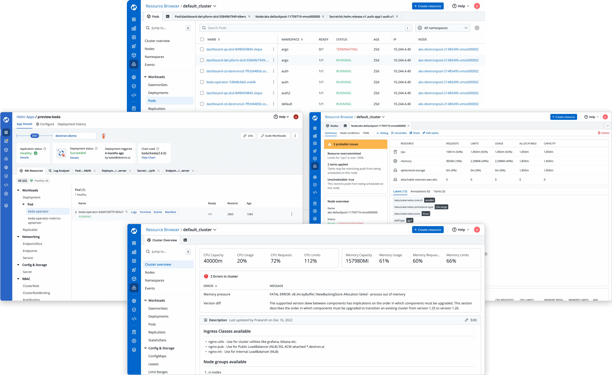

# Kubernetes Helm Dashboard Powered by Devtron



## 📕 Overview

Helm is one of the most adopted package managers for deploying applications to Kubernetes.
The intuitive Helm Dashboard offers a UI-driven approach for managing the lifecycle of Helm Applications, abstracting out all the complexities and challenges.

Through the dashboard, one can:

- Manage community and custom helm charts
- See manifest diff of past revisions
- Easily rollback or upgrade between different versions
- Seamlessly integrate and deploy multiple charts together using [Chart Groups](https://docs.devtron.ai/usage/deploy-chart/chart-group)

## 🖱 Installation

Before you begin, you must create a [Kubernetes cluster](https://kubernetes.io/docs/tutorials/kubernetes-basics/create-cluster/) (preferably K8s 1.16 or higher) and install [Helm](https://helm.sh/docs/intro/install/).

### Install Helm Dashboard Powered by Devtron

Run the following command to install the latest version of Devtron:

```bash
helm repo add devtron https://helm.devtron.ai
```
```bash
helm install devtron devtron/devtron-operator --create-namespace --namespace devtroncd
```

### Access the dashboard

**URL**: Use the following command to get the dashboard URL:

```bash
kubectl get svc -n devtroncd devtron-service -o jsonpath='{.status.loadBalancer.ingress}'
```

### Credentials

**Username**:  `admin` <br>
**Password**:   Run the following command to get the admin password: 
1. For Devtron version **v0.6.0** and higher
```bash
kubectl -n devtroncd get secret devtron-secret -o jsonpath='{.data.ADMIN_PASSWORD}' | base64 -d
```
2. For Devtron version less than **v0.6.0**
```bash
kubectl -n devtroncd get secret devtron-secret -o jsonpath='{.data.ACD_PASSWORD}' | base64 -d
```

### Installation status

The above install command starts the **Devtron-operator**, which takes a couple of minutes to spin up all of the Devtron micro-services one by one. You may check the status of the installation with the following command:

```bash
kubectl -n devtroncd get installers installer-devtron \
-o jsonpath='{.status.sync.status}'
```

The command executes with one of the following output messages, indicating the status of the installation:

* **Downloaded**: The installer has downloaded all the manifests, and installation is in-progress.
* **Applied**: The installer has successfully applied all the manifests, and the installation is completed.

**Note:** For different installation methods and integrations, please refer to the [documentation](https://docs.devtron.ai/getting-started/install/install-devtron-with-cicd)

## 📍 Why Helm Dashboard Powered by Devtron?
- Simplified Access Management
- Active Resources Monitoring
- Optimized Resource Grouping
- Multi-cluster Helm Application Management
- Out-of-the-box Support for Workload Hibernation

## 💪 Trusted By
 
The Helm Dashboard is being used and trusted by enterprises and communities all across the globe. Some of them are:

- [Delhivery](https://www.delhivery.com/)
- [BharatPe](https://bharatpe.com/)
- [Livspace](https://www.livspace.com/in)
- [Moglix](https://www.moglix.com/) 
- [Xoxoday](https://www.xoxoday.com/)
 
## 👥 Community & Support

Get updates and chat with project maintainers, contributors, and community members
- Feel free to check out the [Documentation](https://www.docs.devtron.ai/)
- Follow [@DevtronL](https://twitter.com/DevtronL) on Twitter
- Raise feature requests, suggest enhancements, and report bugs in [GitHub Issues](https://github.com/devtron-labs/helm-ui/issues)
- Interested to contribute? Be sure to check out [Devtron on GitHub](https://github.com/devtron-labs/devtron) 🌟
- Articles, How-to, Tutorials - [Devtron Blogs](https://devtron.ai/blog/)
 
### Join us on Discord 

<p>
<a href="https://discord.gg/jsRG5qx2gp"></a>
</p>

## :bookmark: License
 
Kubernetes Helm Dashboard powered by Devtron is licensed under [Apache License, Version 2.0](LICENSE)
